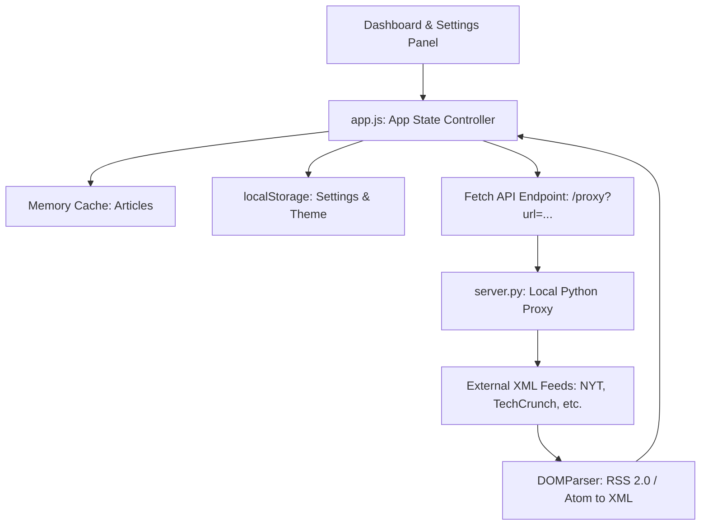

# PulseFeed — Premium RSS News Dashboard
PulseFeed is a high-fidelity, responsive single-page web application (SPA) designed to aggregate, parse, analyze, and display news from multiple RSS and Atom feeds. It features a customizable settings dashboard and a client-side trending algorithm that highlights the hottest stories in a sleek, glassmorphic layout.
---
## Key Features
1.  **Glassmorphic Design System**: Styled with custom HSL variables supporting full fluid grids, responsive scaling (desktop to mobile), micro-animations, and a manual Light/Dark theme toggle.
2.  **Trending News Carousel**: A 5-slide, autoplaying banner at the top of the dashboard highlighting the most talked-about ("fire") news.
    *   **The Heuristic Algorithm**: The app tokenizes headlines in the current view, filters out English stop-words, calculates keyword frequency, and scores articles based on recency, image presence, and keyword matches.
    *   **Interactivity**: Autoplay cycles every 5 seconds, pauses on mouse hover, and supports manual arrow and index-dot controls.
3.  **Dynamic Category Manager**: Renders subscription categories as interactive chips.
    *   **Tag Input**: Located in settings; typing a category name and pressing Enter automatically converts the tag into a closeable chip and generates a default Google News search RSS feed for immediate integration.
    *   **Filters**: Dashboard tabs show "All" feeds alongside individual active categories. Clicking a tab filters the main feed instantly.
4.  **Feed Source URL Manager**: Detailed configurations inside the settings panel.
    *   Users can view, add, or delete individual RSS feed URLs for *each* category.
    *   If all feed links are removed from a category, it alerts the user and provides a one-click restore link back to the fallback Google News feed.
5.  **Built-in Local Proxy Server**: Solves browser CORS errors and bypassing institutional firewalls/filters (which often flag public proxies like `corsproxy.io` as "Web Filter Violations"). It routes requests locally, adds CORS headers, and ignores invalid SSL cert chains.
6.  **Persistence**: Subscribed categories, active themes, and custom feed links are automatically saved and reloaded using `localStorage`.
---
## System Architecture

---
## Predefined Category Settings
By default, the application is initialized with the following categories and high-quality sources:
*   **AI-related news**
    *   `https://techcrunch.com/category/artificial-intelligence/feed/`
    *   `https://www.wired.com/feed/tag/ai/latest/rss`
*   **Android-related news**
    *   `https://www.androidpolice.com/feed/`
    *   `https://www.androidcentral.com/feed`
*   **US-related news**
    *   `https://rss.nytimes.com/services/xml/rss/nyt/US.xml`
    *   `https://feeds.npr.org/1003/rss.xml`
*   **Apple-related news**
    *   `https://macrumors.com/macrumors.xml`
    *   `https://9to5mac.com/feed/`
*   **Google-related news**
    *   `https://9to5google.com/feed/`
    *   `https://news.google.com/rss/search?q=Google`
*   **Samsung-related news**
    *   `https://www.sammobile.com/feed/`
    *   `https://news.google.com/rss/search?q=Samsung`
*Note: Any custom category added by the user defaults to: `https://news.google.com/rss/search?q={category_name}`.*
---
## File Structure
```text
news_app/
├── index.html   # Main layout structure & CDN imports
├── style.css    # Colors (light/dark variables), grids, & drawer animations
├── app.js       # App state, RSS XML parsing, trending analysis, & event binders
├── server.py    # Local HTTP server & custom CORS/SSL-bypass proxy
└── README.md    # Project overview and requirements document (this file)
```
---
## Getting Started & Execution
To run the application locally on your machine:
1.  **Navigate** to the project directory in your terminal.
2.  **Start the local proxy server**:
    ```bash
    python3 server.py 8000
    ```
3.  **Open the application**:
    Access the interface in your browser at [http://localhost:8000](http://localhost:8000).
### CORS & Network Bypasses:
*   **Proxy Mode (Default)**: While running from `localhost`, the app routes all fetches through `/proxy?url=<feed>` to let `server.py` execute standard Python queries, avoiding browser CORS restrictions.
*   **Fallback Mode**: If you launch `index.html` as a standalone file (e.g. by double-clicking it on disk using `file://` protocol), `app.js` detects this and redirects queries to the public proxy `https://corsproxy.io/?`.
